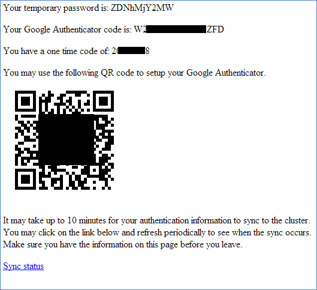
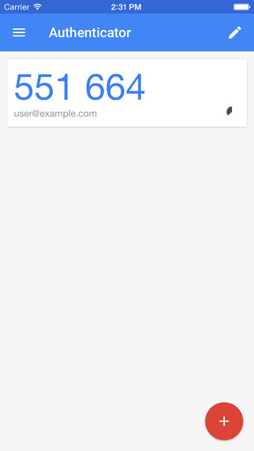

```{r, echo=FALSE}
library(knitr)
knitr::knit_hooks$set(inline = as.character)
knitr::opts_chunk$set(cache=T, echo = F, fig.height = 5, results="hide", message=F, warning = F)
knitr::opts_knit$set(eval.after = 'fig.cap')
```

# Setup

## Access

- Contact [hpc-help@iastate.edu](hpc-help@iastate.edu) for an account. 
- Install [Google Authenticator](http://hpcgroup.public.iastate.edu/HPC/Condo/IGA.html) on a mobile phone.
- Follow the instructions in the setup email.

## Configure



## Google Authenticator



## Login

- Log in to...
    - submit jobs: `ssh <user>@condo.its.iastate.edu`
    - transfer large data: `ssh <user>@condodtn.its.iastate.edu`
- Enter the verification code from Google Authenticator.
- Enter your password.


# Usage

## Folders

- Home directory for miscellaneous files: `/home/<user>`
- Most cluster jobs: `/home/<group>/<user>`
- Cluster jobs with large data files: `/ptmp/<group>/<user>`


## Get large data from `impact4`

- Log into the data transfer node and create you `ptmp` folder.

```
ssh condodtn.its.iastate.edu
mkdir /ptmp/STAT/landau
cd /ptmp/STAT/landau
```

- Use `rsync` to get some data.

```
rsync -ae 'ssh -p 323' landau@impact4.stat.iastate.edu:example_data .
```

- `scp` is an alternative, but less preferred.

```
scp -rP 323 landau@impact4.stat.iastate.edu:example_data .
```

## Submit an R job on Condo.

- Log in and set up your work directory

```
ssh condo.its.iastate.edu
mkdir /work/STAT/landau
cd /work/STAT/landau
```

- Create a script file (i.e., `example.script`) with shell commands to be executed on the cluster.
- Submit the job with 

```
qsub example.script
```

- Check the job status with `qstat` or `qtop`.

## Documentation and examples

[https://github.com/wlandau/condo](https://github.com/wlandau/condo)


